# 🏋️ Multi Gym Booking System

> A scalable **multi-tenant** gym management and booking system built with Python — automating bookings, attendance tracking, and member communication through Telegram and WhatsApp, with a professional real-time admin dashboard.

---

## 🚀 Key Concept

Most gym systems fail at one thing: **communication + automation at scale.**

This system acts as a **messaging-first booking engine** — members interact naturally through WhatsApp or Telegram, while the backend handles everything automatically:

- Session scheduling & booking validation
- Automated reminders before classes
- Attendance tracking
- Multi-branch (multi-tenant) isolation
- Real-time admin monitoring dashboard

---

## ✨ Features

| Feature | Description |
|---|---|
| 🏢 Multi-tenant architecture | Each gym operates independently using `gym_id` |
| 🤖 Telegram Bot | Full booking flow in Arabic & English |
| 💬 WhatsApp Webhook | Natural conversation-based booking |
| 📅 Booking Engine | Validation, capacity checks, waitlist management |
| ⏰ Reminder Workers | Automated pre-class reminders |
| ✅ Attendance Tracking | Check-in, no-show recording, history |
| 📊 Admin Dashboard | Real-time Streamlit dashboard with analytics |
| 🔄 Background Workers | Custom async loops for reminders & attendance |

---

## 📊 Admin Dashboard

A professional real-time dashboard built with Streamlit featuring:

- **KPI Cards** — Classes today, active bookings, waitlist, new requests
- **Filters Bar** — Filter by day, source, class, coach, and request status
- **Alerts Center** — Full classes, repeat no-shows, pending waitlist offers
- **Live Activity Feed** — Real-time stream of bookings, waitlist joins, attendance
- **Class Cards** — Occupancy bars, member lists, session stats per class
- **Analytics Tab** — Booking trends, source split, top classes, peak times
- **Bookings Management** — Check-in, no-show, cancel actions per booking
- **Attendance Records** — Daily attendance table with export
- **Waitlist Management** — Status tracking with CSV export
- **Admin Requests** — Workflow management for contact requests from bots

---

### 🖥️ Dashboard Screenshots

#### Overview & KPIs
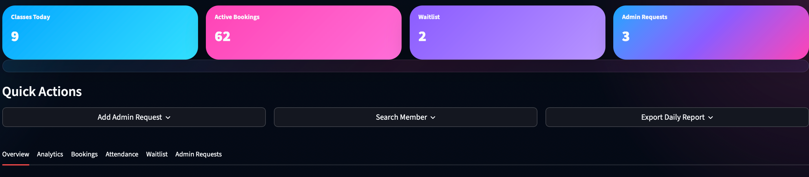
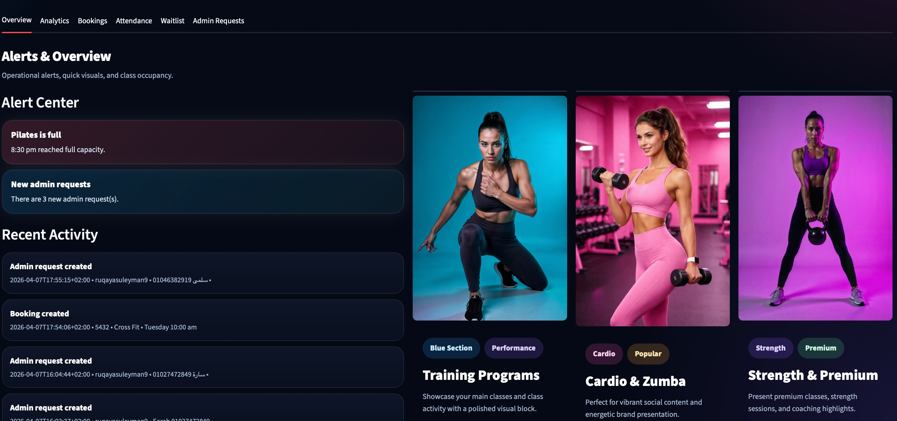

#### Classes & Members
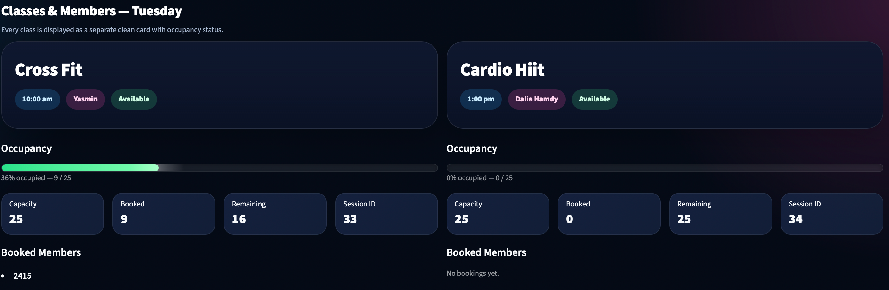
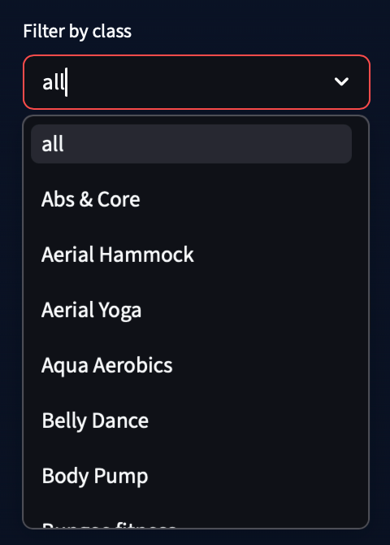

#### Bookings Management
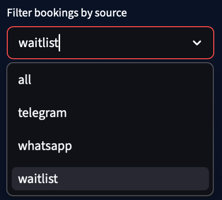

#### Coaches
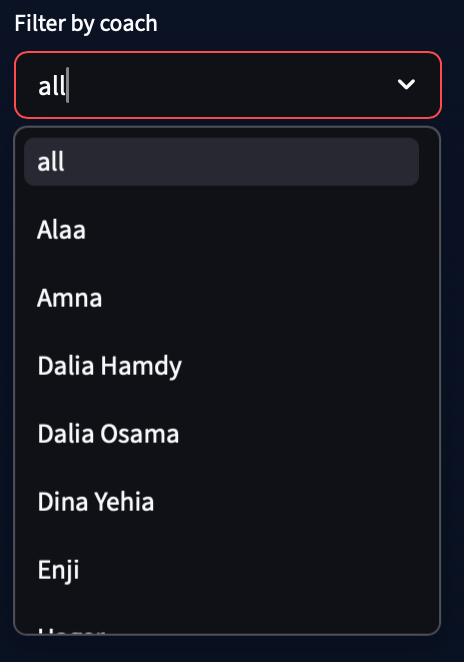

#### Select Day
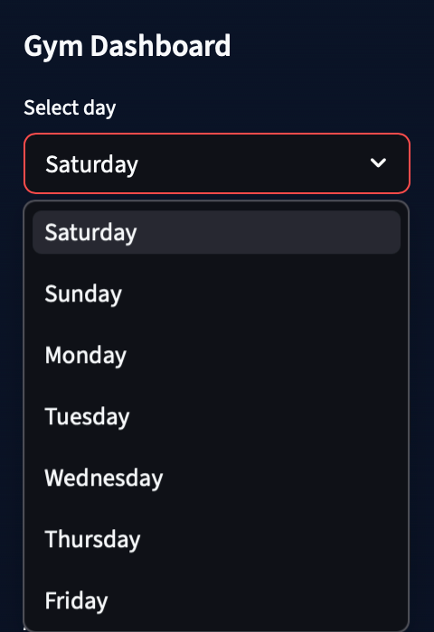

#### Waitlist
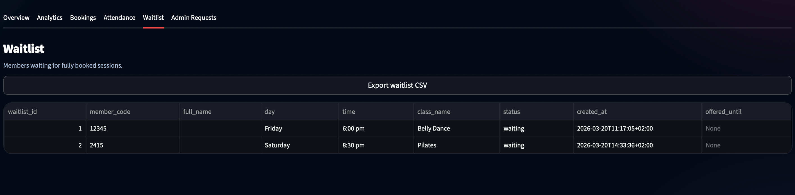

#### Member Search
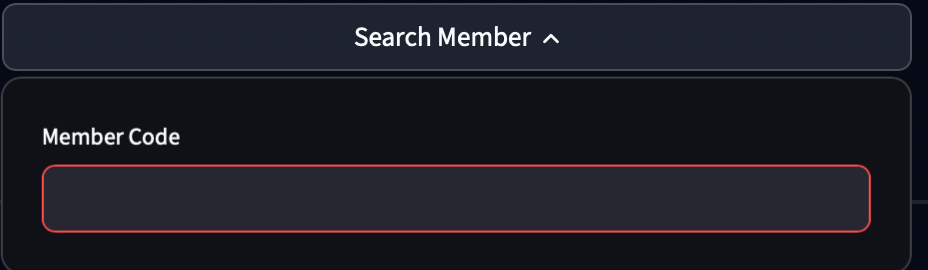

#### Admin Requests
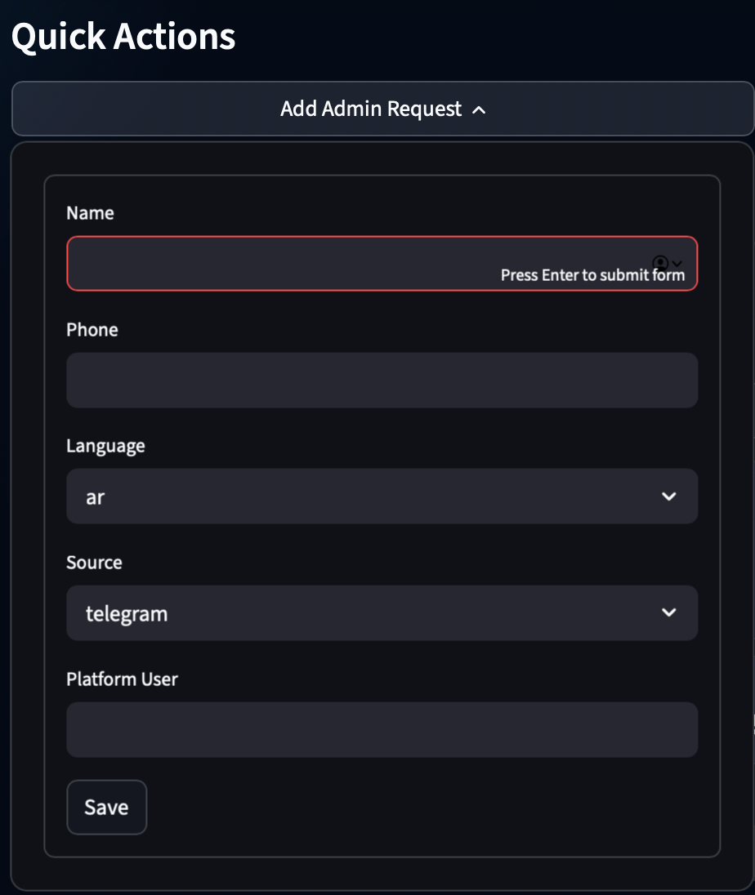
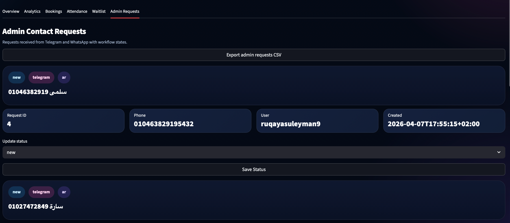

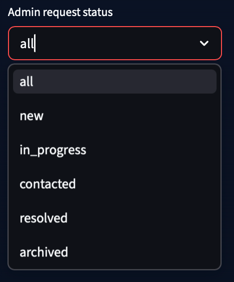

---

## 💬 Bot Experience

### WhatsApp Booking

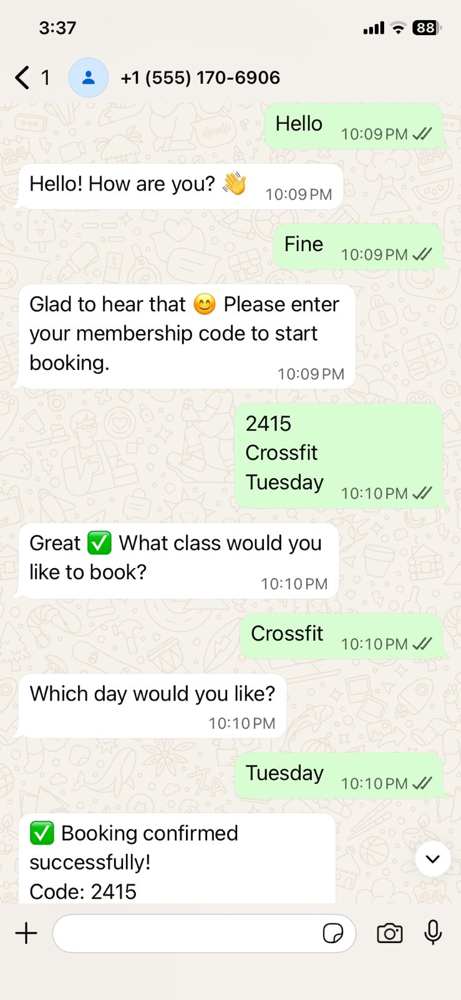

### Telegram — English Flow
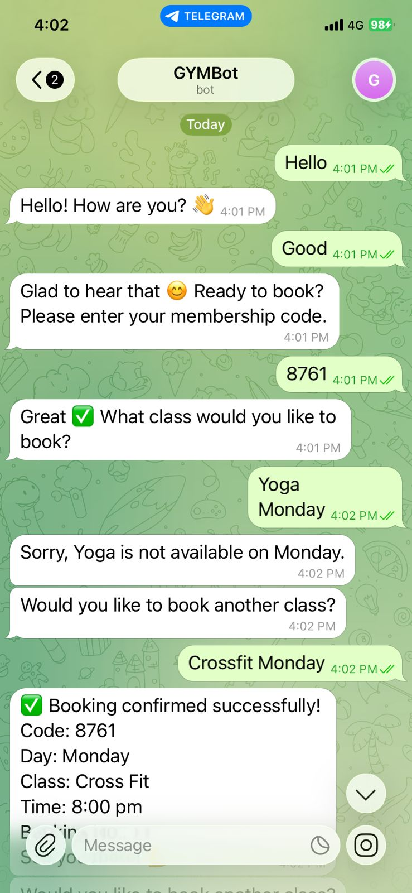
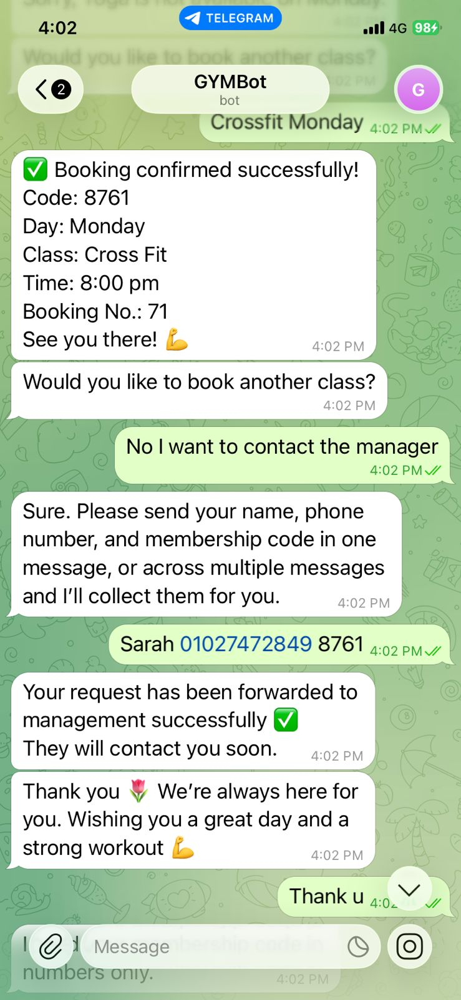

### Telegram — Arabic Flow
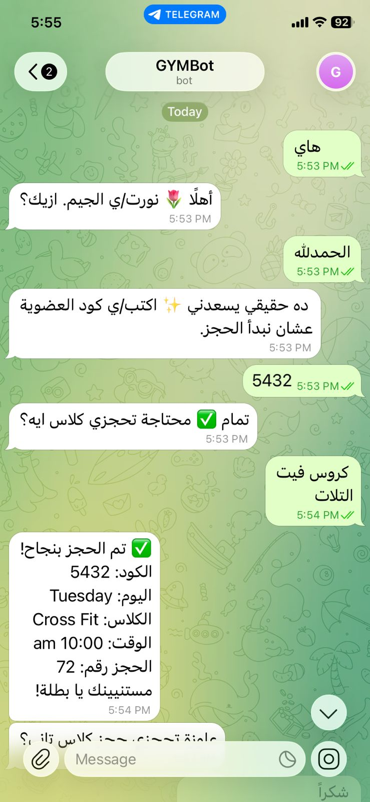
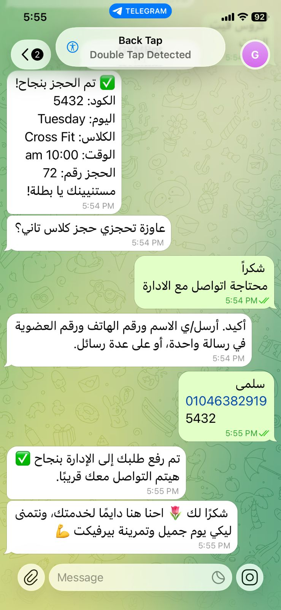

---

## 🧠 System Architecture

```
User (WhatsApp / Telegram)
        │
        ▼
  Messaging Layer
  ├── Telegram Bot
  └── WhatsApp Webhook
        │
        ▼
  Core Logic Layer
  ├── Booking Engine (validation, capacity, waitlist)
  ├── Conversation Manager (Arabic / English)
  └── Gym System (multi-tenant routing via gym_id)
        │
        ▼
  Workers Layer
  ├── Reminder Worker (pre-class notifications)
  └── Attendance Worker (auto tracking loop)
        │
        ▼
  Database (SQLite → PostgreSQL ready)
        │
        ▼
  Admin Dashboard (Streamlit — real-time monitoring)
```

---

## 🛠 Tech Stack

| Layer | Technology |
|---|---|
| Language | Python 3.11+ |
| Bots | Telegram Bot API, WhatsApp Cloud API |
| Dashboard | Streamlit + Plotly |
| Database | SQLite (dev) → PostgreSQL (prod) |
| Workers | Custom async background loops |

---

## 📁 Project Structure

```
multi-gym-booking-system/
├── app/
│   ├── core/
│   │   ├── booking_logic.py
│   │   ├── conversation.py
│   │   └── gym_system.py
│   ├── bots/
│   │   ├── telegram_bot.py
│   │   ├── whatsapp_webhook.py
│   │   └── whatsapp_utils.py
│   ├── workers/
│   │   ├── reminder_worker.py
│   │   └── worker_attendance.py
│   └── dashboard/
│       └── admin_dashboard.py
├── database/
│   ├── db.py
│   └── gym.sqlite3
├── assets/screenshots/
├── app.py
├── seed_data.py
├── requirements.txt
├── .env.example
└── README.md
```

---

## ⚙️ Setup & Installation

### 1. Clone the repository
```bash
git clone https://github.com/ruqaya-suleyman/multi-gym-booking-system.git
cd multi-gym-booking-system
```

### 2. Create & activate virtual environment
```bash
python -m venv .venv
source .venv/bin/activate      # macOS / Linux
.venv\Scripts\activate         # Windows
```

### 3. Install dependencies
```bash
pip install -r requirements.txt
```

### 4. Configure environment variables
```bash
cp .env.example .env
```
```env
TELEGRAM_BOT_TOKEN=your_token_here
WHATSAPP_VERIFY_TOKEN=your_token_here
OPENAI_API_KEY=your_key_here
DATABASE_URL=database/gym.sqlite3
```

### 5. Run the system
```bash
python app.py
```

### 6. Run the admin dashboard
```bash
streamlit run app/dashboard/admin_dashboard.py
```

### 7. Load demo data (optional)
```bash
python seed_data.py
```
> Generates 30 members, sessions across all days, bookings, attendance records, and admin requests for testing.

---

## 🔄 How It Works

```
1. Member sends message via WhatsApp or Telegram
2. System identifies the gym via gym_id
3. Booking engine validates → checks capacity → confirms or waitlists
4. Confirmation sent back to the member
5. Reminder worker sends pre-class notifications
6. Attendance worker tracks check-ins and no-shows
7. Admin dashboard reflects all data in real-time
```

---

## 🧩 Multi-Tenant Design

Every entity is scoped by `gym_id`, ensuring complete isolation between gyms:

```python
SELECT * FROM bookings WHERE gym_id = ? AND status = 'booked'
```

- ✅ Complete data isolation between gyms  
- ✅ Scalable to unlimited branches  
- ✅ Easy onboarding of new clients  

---

## 🔮 Future Improvements

- [ ] PostgreSQL for production scale
- [ ] FastAPI REST API layer
- [ ] Authentication & role management
- [ ] Cloud deployment (Railway / Render / AWS)
- [ ] Advanced analytics — retention, churn, revenue

---

## ⚠️ Notes

- `.env` is excluded from version control
- `*.sqlite3` files are excluded — use `seed_data.py` for demo data
- SQLite is for development only — use PostgreSQL in production

---

## 👤 Author

**Ruqaya Suleyman**

---

## 💡 About This Project

This is not just a booking app — it's a **multi-tenant, communication-driven gym management system** designed for real-world deployment. The architecture prioritizes automation, scalability, and a frictionless member experience through the messaging apps they already use daily.
