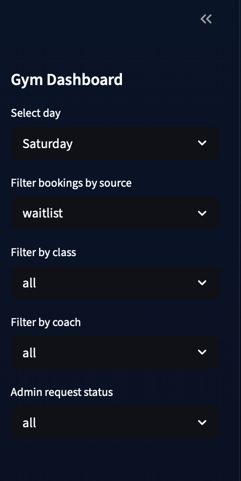

# 🏋️ Multi Gym Booking System

A scalable multi-tenant gym management and booking system built with Python, enabling gyms to automate bookings, attendance tracking, and communication through Telegram and WhatsApp.
Designed as a real-world solution, the system supports multiple gyms (tenants) with isolated data, automated workflows, and an extensible architecture.
---

## 🚀 Key Concept

Most gym systems fail at one thing: communication + automation at scale.
This system solves that by acting as a messaging-first booking engine, where users interact naturally through WhatsApp or Telegram, while the backend handles:
- Session scheduling
- Booking validation
 -Reminders
- Attendance tracking
- Multi-branch logic
---

## 🧠 System Architecture

- Multi-tenant design → each gym operates independently using gym_id
- Messaging layer → Telegram Bot + WhatsApp Webhook
- Core logic layer → booking engine, scheduling, validation
- Workers layer → reminders + attendance loops
- Admin layer → Streamlit dashboard for monitoring

---

## ✨ Features

- Multi-gym (multi-tenant) architecture
- Booking & scheduling engine
- Telegram bot integration
- WhatsApp webhook integration
- Automated reminder system
- Attendance tracking system
- Admin dashboard (Streamlit)
- Background workers (custom loops)
- Scalable database design

---

## 📸 Dashboard Preview

### Overview


---

### Gym Dashboard



---

### Classes & Members


---

### Coaches


---

### Bookings


---

### Waitlist


---

### Member Search


---

## 📩 Admin Requests

### Quick Action


### Contact Requests


### Requests List


---

## 💬 WhatsApp Booking Experience


---

## 🤖 Telegram Bot Experience

### English Flow


### Arabic Flow


---


```

## 🛠 Tech Stack

- Python
- SQLite (development)
- Telegram Bot API
- WhatsApp Cloud API (Webhook)
- Streamlit (Dashboard)
- Custom background workers
```


# 📁 Project Structure
> The project follows a modular architecture separating core logic, integrations, workers, and dashboard components for scalability and maintainability.
```
## 📁 Project Structure

```bash
.
├── app/
│   ├── core/
│   │   ├── booking_logic.py
│   │   ├── conversation.py
│   │   └── gym_system.py
│   │
│   ├── bots/
│   │   ├── telegram_bot.py
│   │   ├── whatsapp_webhook.py
│   │   └── whatsapp_utils.py
│   │
│   ├── workers/
│   │   ├── reminder_worker.py
│   │   ├── workers_reminders.py
│   │   ├── worker_attendance.py
│   │   └── worker_attendance_loop.py
│   │
│   └── dashboard/
│       └── admin_dashboard.py
│
├── database/
│   ├── database.py
│   ├── db.py
│   ├── gym.db
│   └── gym.sqlite3
│
├── assets/
│   └── screenshots/
│
├── config/
│   └── .env
│
├── app.py
├── requirements.txt
├── README.md
└── .env.example

```

## ⚙️ Setup
- 1- Create virtual environment
```
python -m venv .venv
```

- 2- Activate it
```
source .venv/bin/activate
```
- 3- Install dependencies
```
pip install -r requirements.txt
```
- 4- Configure environment variables
- Create .env file based on .env.example:
```
TELEGRAM_BOT_TOKEN=
WHATSAPP_VERIFY_TOKEN=
OPENAI_API_KEY=
DATABASE_URL=
```
- 5- Run the system
```
python app.py
```

## 🔄 How It Works
- User sends message via WhatsApp or Telegram
- System identifies the gym (gym_id)
- Booking logic processes request
- Session is created or updated
- Worker schedules reminders
- Attendance is tracked automatically

## 🧩 Multi-Tenant Design
- Every entity in the system is scoped by:
```
gym_id
```
-This ensures:
* Complete data isolation
* Scalability across multiple gyms
* Easy onboarding of new clients
 
## 📊 Admin Dashboard
-The system includes a Streamlit dashboard for:
- Viewing bookings
- Monitoring attendance
- Managing sessions
- Observing system activity
```
streamlit run admin_dashboard.py
```
## 🔮 Future Improvements
- PostgreSQL for production
- FastAPI REST API layer
- Authentication & role management
- Cloud deployment (AWS / Railway / Render)
- Advanced analytics dashboard

## ⚠️ Notes
- .env is excluded for security
- SQLite is used for development only
- Designed for scalability and modular expansion

## 👤 Author
Ruqaya Suleyman

## 💡 Positioning
This is not just a booking app — it's a multi-tenant communication-driven system designed for real-world deployment in gyms and service-based businesses.

